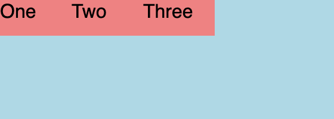
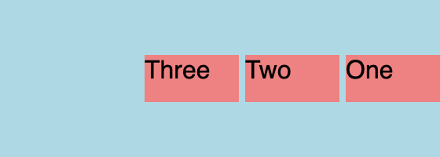

# css-fx-layout 📚


[](https://www.npmjs.com/package/css-fx-layout)

This is a lightweight and modular SCSS flexbox library. It is inspired by Angular's [Flex-Layout](https://github.com/angular/flex-layout) and can replace the
most popular functions of the (by now deprecated) Angular library.

**Info:** This library is actively maintained and is already feature-complete, functioning as intended. Future releases will focus primarily on providing bug fixes and addressing similar issues to ensure a smooth user experience.

## Features

This library gives you the option between using CSS classes or data-attributes. Both options give you the same features but the CSS classes can be more verbose when you want a more complex layout.

**Please refer to the documentation on [https://philmtd.github.io/css-fx-layout](https://philmtd.github.io/css-fx-layout) for a full list of all available selectors and features.**

### HTML data-attribute selectors

Using the data attributes is the easiest way to use this library and easier to migrate to from Angular Flex-Layout:

For example css-fx-layout provides attributes like the following, which can be configured through the values passed to them:

* `data-layout` and `data-layout-align`
* `data-layout-gap`
* `data-hide-...` and `data-show-...`
* `data-flex`

### CSS class selectors

Using the CSS classes is more verbose and the more "CSS-y" way of styling your HTML:

For example css-fx-layout provides classes with naming patterns like:

* `fx-layout-...` and `fx-align-...`
* `fx-gap-...`
* `show-...` and `hide-...`
* `fx-flex-...`

### Responsive API

The library provides a responsive API which allows to create different layouts for different screen sizes using known breakpoints
like `xs`, `sm`, `md`, `lg`, `xl` and including `lt-` and `gt-` variations of them. Please check out the [documentation](https://philmtd.github.io/css-fx-layout/docs/responsive)
for details on how to use it.

## Getting started

Add the library to your project's `package.json`:

```bash
npm i -s css-fx-layout
```

Then follow the [Getting Started](https://philmtd.github.io/css-fx-layout/docs/getting-started) guide in the documentation.

## Examples

These are just two simple examples how to use `css-fx-layout`. Visit [the examples page](https://philmtd.github.io/css-fx-layout/examples) for more and live-rendered
examples.

### Layout

#### Example 1
This is the simplest example. It will make the div a flex container and align the three spans in a row:

<table>
<tr>
<th>CSS Classes</th>
<th>Data Attributes</th>
</tr>
<tr>
<td>

```html
<div class="fx-layout-row">
    <span>One</span>
    <span>Two</span>
    <span>Three</span>
</div>
```

</td>     
<td>   

```html
<div data-layout="row">
    <span>One</span>
    <span>Two</span>
    <span>Three</span>
</div>
```

</td>
</tr>
</table>

The resulting layout:




#### Example 2
An advanced example that aligns the items in reverse order with a gap of four pixels and vertically centered:

<table>
<tr>
<th>CSS Classes</th>
<th>Data Attributes</th>
</tr>
<tr>
<td>

````html
<div class="fx-layout-row 
            fx-layout-reverse 
            fx-align--start-x 
            fx-align--x-center 
            fx-gap--4px">
    <span>One</span>
    <span>Two</span>
    <span>Three</span>
</div>
````

</td>     
<td>   

````html
<div data-layout="row reverse" 
     data-layout-align="start center" 
     data-layout-gap="4px">
    <span>One</span>
    <span>Two</span>
    <span>Three</span>
</div>
````

</td>
</tr>
</table>

The resulting layout:




## What problem does this library solve?

Initially I created this library because I liked the convenient syntax of Angular Flex-Layout and wanted to use it in non-Angular 
projects and without JavaScript.

By now Angular Flex-Layout has been deprecated and this library can be a replacement for most of the popular parts.
