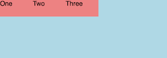
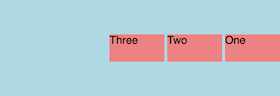

# css-fx-layout

[](https://circleci.com/gh/philmtd/css-fx-layout/tree/master)
[](https://www.npmjs.com/package/css-fx-layout)

This is a lightweight SCSS flexbox library. It is inspired by Angular's [Flex-Layout](https://github.com/angular/flex-layout) and can replace the
most popular functions of the (by now deprecated) Angular library.

## Features

This library gives you the option between using CSS classes or data-attributes. Both options give you the same features but the CSS classes can be more verbose when you want a more complex layout.
Check out the [Wiki](https://github.com/philmtd/css-fx-layout/wiki) for a detailed documentation.

### CSS class selectors

Using the CSS classes is more verbose but the recommended way to use this library:

* `.fx-layout-` and `.fx-align-`: CSS classes to control the flexbox container
* `.fx-gap--`: CSS classes to add gaps between the elements in a flex container
* `.show-` and `.hide-`: CSS classes which can be used to show/hide elements depending on the screen size
* `.fx-flex` and `.fx-glex-grow`: Classes to control flex behaviour of an element

### HTML data-attribute selectors

Using the data attributes is the easiest way to use this library and easier to migrate to from Angular Flex-Layout:

* `data-layout` and `data-layout-align`: HTML attributes to be used to control the flexbox container
* `data-layout-gap`: attribute to add gaps between the elements in a flex container
* `data-hide-` and `data-show-`: attributes which can be used to show/hide elements depending on the screen size
* `data-fx-flex` and `data-fx-flex-grow`: Control flex behaviour of an element

### Responsive API

The library provides a responsive API which allows to create different layouts for different screen sizes using known breakpoints
like `xs`, `sm`, `md`, `lg`, `xl` and including `lt-` and `gt-` variations of them. Please check out the [Wiki](https://github.com/philmtd/css-fx-layout/wiki)
for details on how to use it.

### SCSS Mixins

All functionality is also available as mixins to accompany this library or to create your own customized selectors.

## Getting started

Add the library to your project's `package.json`:

```bash
npm i -s css-fx-layout
```

Then use the provided mixins in your main stylesheet to include the css-fx-layout selectors. You can choose between using CSS classes
or HTML data attributes (or, while not recommended, use both). If you want to use the layout-gap functionality you can customise which selectors
are going to be generated by providing the start, end and unit as shown in the example below.

<table>
<tr>
<th>CSS Classes</th>
<th>HTML Data Attributes</th>
</tr>
<tr>
<td>

````scss
@use "css-fx-layout" as fx;

// If you want to include the responsive API selectors
$includeResponsiveApi: true;

// If you choose to use CSS class selectors:
@include fx.class-selectors($includeResponsiveApi);
@include fx.gap-class-selectors(1, 16, px em, $includeResponsiveApi);
````

</td>     
<td>   

````scss
@use "css-fx-layout" as fx;

// If you want to include the responsive API selectors
$includeResponsiveApi: true;

// If you choose to use attribute selectors:
@include fx.attribute-selectors($includeResponsiveApi);
@include fx.gap-attribute-selectors(1, 16, px em, $includeResponsiveApi);
````

</td>
</tr>
</table>

## Examples

These are some basic examples how to use `css-fx-layout`. The file `./test/index.html` contains more examples.

### Layout

#### Example 1
This is the simplest example. It will make the div a flex container and align the three spans in a row:

<table>
<tr>
<th>CSS Classes</th>
<th>Data Attributes</th>
</tr>
<tr>
<td>

```html
<div class="fx-layout-row">
    <span>One</span>
    <span>Two</span>
    <span>Three</span>
</div>
```

</td>     
<td>   

```html
<div data-layout="row">
    <span>One</span>
    <span>Two</span>
    <span>Three</span>
</div>
```

</td>
</tr>
</table>

The resulting layout:




#### Example 2
An advanced example that aligns the items in reverse order with a gap of four pixels and vertically centered:

<table>
<tr>
<th>CSS Classes</th>
<th>Data Attributes</th>
</tr>
<tr>
<td>

````html
<div class="fx-layout-row 
            fx-layout-reverse 
            fx-align--start-x 
            fx-align--x-center 
            fx-gap--4px">
    <span>One</span>
    <span>Two</span>
    <span>Three</span>
</div>
````

</td>     
<td>   

````html
<div data-layout="row reverse" 
     data-layout-align="start center" 
     data-layout-gap="4px">
    <span>One</span>
    <span>Two</span>
    <span>Three</span>
</div>
````

</td>
</tr>
</table>

The resulting layout:



#### Example 3
Vertically and horizontally center an element in its parent.

<table>
<tr>
<th>CSS Classes</th>
<th>Data Attributes</th>
</tr>
<tr>
<td>

```html
<div class="fx-layout-row 
            fx-align--center-x 
            fx-align--x-center">
    <span>One</span>
</div>
```

</td>     
<td>   

```html
<div data-layout="row" 
     data-layout-align="center center">
    <span>One</span>
</div>
```

</td>
</tr>
</table>

The resulting layout:


### Show/Hide

#### Example 4
This will hide the first span on `sm` sized screens and show the second span only on `lg` sized screens. The third span is always visible.

<table>
<tr>
<th>CSS Classes</th>
<th>Data Attributes</th>
</tr>
<tr>
<td>

```html
<div>
    <span class="hide-sm">One</span>
    <span class="show-lg">Two</span>
    <span>Three</span>
</div>
```

</td>     
<td>

```html
<div>
    <span data-hide-sm>One</span>
    <span data-show-lg>Two</span>
    <span>Three</span>
</div>
```

</td>
</tr>
</table>
 
### Compiled CSS
There are no pre-compiled CSS files available for css-fx-layout 2 and above.
Version 1 releases provided minified pre-compiled CSS files. If you are interested in them you can find and download them from
the [releases page](https://github.com/philmtd/css-fx-layout/releases/).

## What problem does this library solve?

Initially I created this library because I liked the convenient syntax of Angular Flex-Layout and wanted to use it in non-Angular 
projects and without JavaScript.

By now Angular Flex-Layout has been deprecated and this library can be a replacement for most of the popular parts.
